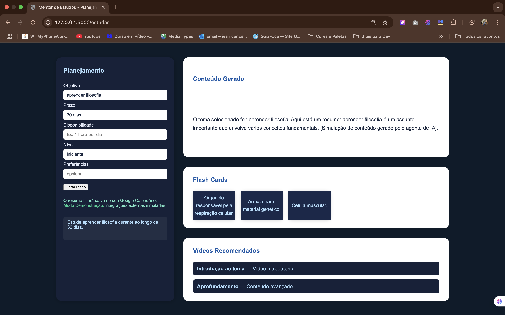

# Mentor de Estudos IA

**Modo Demonstração ativado:**  
Este projeto está configurado para avaliação SEM autenticação Google.  
Todas as integrações externas (Google Calendar, YouTube, Gemini) são simuladas para teste rápido dos avaliadores.

- Não é necessário login.
- Os resultados exibidos são exemplos simulados pelo sistema.

⸻

Mentor de Estudos IA

Bem-vindo ao Mentor de Estudos IA – uma aplicação web criada para ajudar qualquer pessoa a organizar seus estudos de forma personalizada e inteligente, aproveitando o poder das APIs do Google Gemini e do YouTube, além de conceitos de Inteligência Artificial.

💡 Sobre o Projeto

Este é o primeiro projeto completo que desenvolvi, com o objetivo de explorar conceitos de automação, integração com APIs, lógica de agentes inteligentes e a construção de uma interface web interativa para estudantes.
A plataforma permite montar um plano de estudos, gerar resumos, conteúdos explicativos, flashcards e até recomendações de vídeos do YouTube, tudo de forma integrada e simples.

🚩 Funcionalidades
	•	Planejador de Estudos (StudyPlanner): Recebe o objetivo do usuário e gera um cronograma personalizado de estudos.
	•	Content Builder: Gera um resumo explicativo sobre o tema escolhido.
	•	FlashCards: Apresenta flashcards interativos para revisar o conteúdo estudado.
	•	Recomendador de Vídeos: Sugere vídeos do YouTube relevantes para complementar o aprendizado.

🧪 Modo Demonstração

:warning: Observação importante:
Por motivos técnicos e de autenticação, o projeto está atualmente rodando em modo demonstração.
	•	Login com Google: Não está habilitado, pois exige configuração de autenticação OAuth real, o que inviabilizaria o teste público e independente.
	•	Google Calendar: Não está integrado no modo demo, mas o código contempla o envio do cronograma para o calendário do Google caso a autenticação seja implementada.
	•	API Gemini e YouTube: No modo demonstração, os agentes simulam respostas. Por exemplo, os flashcards aparecem sempre com o tema de mitocôndria (exemplo fixo). Se estivesse usando a API, o conteúdo seria gerado dinamicamente, de acordo com o objetivo informado.

🔎 Como testar
	1.	Clone o projeto e rode com Python + Flask.
	2.	O sistema funciona em modo demonstração por padrão: preencha o objetivo, prazo, disponibilidade e clique em Gerar Plano.
	3.	O planejamento, conteúdo gerado, flashcards e vídeos são simulados para ilustrar o fluxo de uso real.

📝 Observações Técnicas
	•	Projeto criado como primeira experiência prática com APIs e integração web.
	•	Foco principal em proporcionar uma boa experiência de uso e visual moderna.
	•	Flashcards apresentam exemplos fixos, mas a estrutura está pronta para integrar com APIs generativas.
	•	O design é responsivo e pensado para facilitar o uso mesmo em dispositivos diferentes.

🚀 Possíveis melhorias
	•	Habilitar autenticação real via Google OAuth.
	•	Integrar efetivamente o Google Calendar para salvar cronogramas.
	•	Gerar flashcards e conteúdo de forma dinâmica via Gemini API.
	•	Buscar vídeos do YouTube diretamente com base no tema digitado.

⸻

Espero que você goste do resultado!
Se tiver qualquer dúvida, sugestão ou quiser colaborar, sinta-se à vontade para abrir uma issue ou contribuir.

⸻

Desenvolvido por Jean Carlos De Brito – 2025

